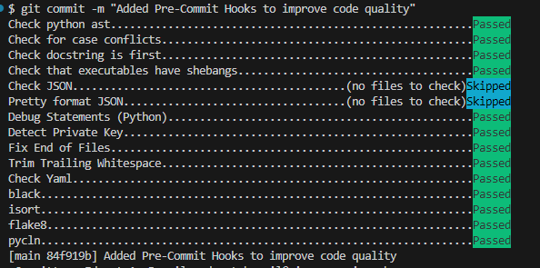

### Project Setup Guide

#### Prerequisites
Ensure you have the following installed on your Windows machine:
1. Basic Understanding of the ff.
    - **Medallion Architecture**
    - **Python**
    - **DBT**
    - **Docker**
    - **MySQL**
    - **Mage.AI**
2. **Gitbash**: [Download Gitbash](https://git-scm.com/downloads)
3. **Docker Desktop**: [Install Docker Desktop](https://docs.docker.com/desktop/setup/install/windows-install/)
4. **VSCode (optional)**: Use any IDE for database management. VSCode with MySQL extensions is recommended.

---

#### Setting Up Python Environment
Follow these steps to set up your Python virtual environment and ensure you’re ready to run dbt commands:

1. Open Gitbash Terminal and navigate to your project directory.
2. Create a Python virtual environment:
    ```bash
    python -m venv venv
    ```
3. Activate the virtual environment:
    ```bash
    source venv/Scripts/activate
    ```
4. Install required libraries
    ```bash
    pip install -r requirements.txt
    ```

---

#### MySQL & Mage.AI Setup with Docker-Compose
To set up MySQL and Mage.AI automatically, run the **setup.sh** script:

```bash
    ./setup.sh
```

---

#### MySQL UI Access (Optional)
You can access **MySQL** through a UI tool like DBeaver or any other IDE of your choice.


- If you're using **VSCode**, we recommend installing **MySQL extension** from the VSCode Extensions Marketplace. It will help you manage your database easily within the IDE.

---

#### Verify DBT Connection to MySQL
After setting up, verify that **dbt** is properly connected to MySQL:

1. Navigate to the local development directory:
    ```bash
    cd scripts
    ```
2. Run the following command to test the connection

    NOTE: Make sure to modify the **target** field under profiles.yml to point to the database or schema you want to test the connection to.
    ```bash
    dbt debug --profiles-dir="${PWD}/dbt/" --project-dir='../dbt'
    ```

---

#### Running DBT Models

Before running **dbt models**, ensure that your **profiles.yml** and **dbt_project.yml** are correctly configured.
Once setup, you can deploy a DBT model using the following command:
```bash
./scripts/deploy-dbt.sh <database or schema> <dbt-model>
```

---

#### Running Data Loader

To load data (Covid Datasets from Github API), run the **data loader** using the following command:
```bash
./scripts/exec-data-loader.sh
```

---

#### MageAI WEb Server UI Access (Optional)
You can access MageAI Web UI via **localhost:6789** for an interactive experience

**MageAI Web Server**


---

#### Create Pipeline in your MageAI Project
While this guide doesn't go into the details of creating pipelines in Mage.AI, the goal is to help you leverage Mage.AI to orchestrate data pipelines, which can serve as an alternative to tools like Airflow,Dagster and etc.

Here are some screenshots to give you an idea of what the Mage.AI pipeline UI looks like:
**MageAI Pipeline**


**MageAI Pipeline Edit**


---

#### Setup Pre-Commit Hooks to Improve Code Quality
To ensure that code quality checks are automatically applied during your development process, Pre-Commit hooks can be integrated alongside the libraries in your **requirements.txt**.
1. Install Pre-Commit

    First, you need to install the Pre-Commit package. This will allow you to automatically run checks before committing code.

    Run the following command to install Pre-Commit:
    ```bash
    pip install pre-commit
    ```

2. Configure Pre-Commit Hooks

    Once Pre-Commit is installed, the next step is to initialize the hooks. This will set up the hooks defined in your **.pre-commit-config.yaml** file.
    ```bash
    pre-commit install
    ```

3. Run Pre-Commit Hooks on All Files

    To ensure that your current codebase is also checked, you need to run the hooks on all files, not just the ones staged for commit.

    Execute the following command:
    ```bash
    pre-commit run --all-files
    ```

    

    This command runs the pre-configured hooks (e.g., code linters, formatters) on all the files in your repository, ensuring that everything complies with your code quality standards.

4. Automatic Execution of Pre-Commit Hooks on Future Commits

    After this setup, every time you make a git commit, the Pre-Commit hooks will automatically be triggered to run the checks defined in your configuration file. This ensures that no commit is made with code that violates your coding standards.

---

#### Additional Notes
- This setup guide is intended for a Windows environment using Docker and Gitbash.
- Customize configuration files (e.g., profiles.yml, dbt_project.yml) as per your specific project requirements.
- Make sure to follow the prerequisites and setup steps carefully to avoid any issues during configuration.
